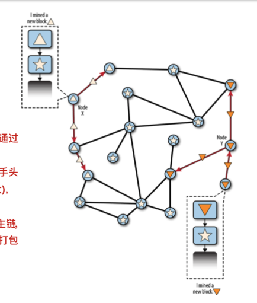
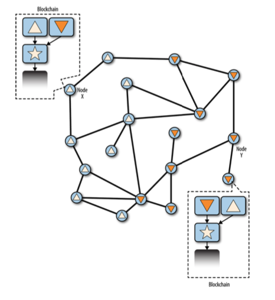

## 1.比特币之前

在比特币诞生之前，人们进行交易，要么是通过实物现金，要么是通过类似银行、支付宝的中心化机构，无法完成真正的点对点的价值转移。早在1998年就有人提出了[bmoney](http://www.weidai.com/bmoney.txt)之类的无需中心化机构提供支持的数字现金系统，很多人在这个方向上做过努力，但无一例外都失败了，最主要的原因是没有解决双花的问题。

## 2.双花

所谓[双花](https://en.wikipedia.org/wiki/Double-spending)（double spending）就是同一份钱花两次，在没有接触类似比特币的去中心化支付系统时，这个问题可能有点反直觉，同一份钱怎么可能用两次呢？

用现金时，不可能发生双花，因为实体的钱已经发生了转移。

在中心化的交易系统如支付宝中，因为所有的交易都需要经过支付宝，所以支付宝知道所有交易发生的先后顺序，当前一笔交易到达时，支付宝已经从你的账户中扣除了相应的金额，支付宝收到后一笔交易时检查你的余额发现已经不够，后一笔交易作废（实际上支付宝中余额不够的时候没办法发起后一笔交易）。

在去中心化的系统中，没有一个所谓的“中心”来记录所有的交易顺序和每个人的账户余额，账本由所有参与网络的节点共同维护，各自保存一份，这种情况就有可能发生双花，因为在分布式的系统中每个人本地保存的账本中数据是有可能不一致的。为了在去中心化的情况下防止双花，我们就必须要有一套系统来记录所有的交易顺序，同时需要所有节点都认同同一份账本数据，这就是比特币需要解决的问题。

## 3.交易

比特币系统中实际上并没有“币”这个概念，所谓的某个地址有多少币是经过一系列的交易输入输出计算出来的未花费交易输出（UTXO）的累计值。

比特币的"币"结构如下：


Alice想向Bob转账1个比特币，Alice取一个面值大于1比特币的未花费交易输出(UTXO)，与Bob的公钥组合后使用自己的私钥进行加密，然后将此笔交易广播出去，收到交易的节点会验证Alice是否具有使用此UTXO的权限（检查Alice的公钥是否与UTXO指向的公钥一致），同时使用Alice的公钥验证这笔交易是否是由Alice本人发出的。

## 4.区块结构

为了维护一个全局的交易顺序账本，比特币将所有交易按照区块串联成一个链式结构：


每个区块包含了前一个区块头的hash值，nonce值以及多笔交易，块与块之间通过hash值串联成一个链式结构。

## 5.工作量证明

工作量证明(proof-of-work)就是比特币系统中的挖矿过程，比特币协议规定，一个合法的区块其hash值必须小于一个给定的值，即区块的hash值必须以一定数量的0开头，区块hash的计算方式如下：

```
block_hash = sha256(prev_block_hash + merkle_root + nonce)
```

(实际的比特币系统中参与hash计算的不止这三个值)

其中prev_block_hash是上一个区块的hash值，merkle_root是当前区块的Merkle树根部位的hash值(将当前区块中所有交易作为叶子节点，逐层向上hash得到一个Merkle树)，nonce是一个随机数。

因为prev_block_hash和merkle_root都是不可变得，为了找到满足条件的hash值，矿工必须不断尝试不同的nonce值来进行hash计算，知道找到一个满足条件的nonce，使得计算出来的block_hash小于某个给定的值。这里的给定值也就是常说的比特币挖矿难度。

假设前4位都是0的区块hash是合法的，找到满足条件的nonce的过程：

```
import hashlib
prev_block_hash = "00000000839a8e6886ab5951d76f411475428afc90947ee320161bbf18eb6048"
merkle_root = "0e3e2357e806b6cdb1f70b54c3a3a17b6714ee1f0e68bebb44a74b1efd512098"
nonce = 0
block_hash = hashlib.sha256((prev_block_hash + merkle_root + str(nonce)).encode()).hexdigest()
while block_hash[:4] != "0000":
	nonce += 1
	block_hash = hashlib.sha256((prev_block_hash + merkle_root + str(nonce)).encode()).hexdigest()
print("nonce: ", nonce)
print("block_hash: ", block_hash)

'''
>>> nonce
65280
>>> block_hash
'000041a7f6c42a08c87a3118655237d8068d6ec04f9926cf5712050a92475f61'
'''
```

找到满足条件的区块hash之后，这就是一个合法的区块了，找到此区块的节点将其广播到全网其他节点，验证区块有效之后将区块加入到链中，同时挖出这个区块的节点将收到一定数量比特币的奖励。

## 6.比特币网络

整个比特币网络包含了非常多的节点，每个节点都需要做下面几件事：

1. 将收到的新交易广播到全网其他节点
2. 将交易组织到区块中
3. 挖矿，不断改变nonce试图找到一个有效的区块
4. 当某个节点找到一个有效的区块时将此区块广播到全网其他节点
5. 节点收到其他节点广播过来的区块后，检查其中每一笔交易的正确性，并验证区块的合法性，通过所有验证的区块将被加入到账本中
6. 节点在新收到的区块上继续进行下一个区块的挖矿工作

比特币协议规定最长的链为权威链，节点为了获得最大的经济利益，都会选择在最长链上进行下一个区块的挖矿。

## 7.分叉

我们这里要介绍的分叉定义为“两个区块拥有了相同的高度”，所谓区块高度是指从创世区块开始当前区块排在第几位。

分叉在比特币网络中是时常发生的事情，因为参与挖矿的节点很多，存在两个节点在同一个区块上同时挖出了下一个区块的可能性。例如，当前最新的区块高度是100，Alice和Bob同时在最新的区块上继续挖矿，同时挖出了两个合法的区块，这两个区块的高度都是101，这时候网络就发生了分叉，一部分节点收到了Alice产生的区块并将其加入了账本，一部分节点收到了Bob的区块并将其加入账本，这时候全网的账本数据就不一致了。

分叉是比较危险的事情，可能导致双花，也会降低攻击网络的算力成本，但好在比特币网络会动态地自动进行修正。

如下图，此时网络中的两个节点Node X 和Node Y同时分别挖出了下一个区块，正三角是X挖出的区块，倒三角是Y挖出的区块，此时距离X近的节点收到了正三角区块，距离Y近的节点收到了倒三角区块：



一段时间后全网的节点分别收到了两个不同的区块，变成如下状态：



此时，某个节点Z在正三角区块上挖出了下一个块，因此正三角这条链更长，于是所有节点都切换到正三角这条链上来，全网数据重新达到一致：


整个比特币网络就处在这样一个动态平衡过程中，虽然绝大部分时候分叉都可以在后续一两个新块出来的时候解决，但发生分叉依然是十分危险的，为了降低发生分叉的概率，比特币协议将出块的时间间隔控制在10分钟左右（通过调整合法区块hash值的前驱0个数来使得出块间隔稳定在10分钟左右），并将区块大小限制在1Mb，10分钟的间隔可以让1Mb的区块充分广播到全网的所有节点，降低分叉的概率。

比特币的区块大小和出块间隔限制使得比特币的交易容量非常低，平均每秒仅能处理7笔交易：

每笔交易的平均大小为250字节，一个区块1Mb能够包含1024*1024/250=4194笔交易，平均每10分钟出一个块，因此每秒交易笔数为：4194/600 = 7 tps (transaction per second)。这样的速度是不可能满足日常使用需求的，因此比特币之后出现了许多新的项目致力于为区块链扩容，提升交易速度。

关于“硬分叉”和“软分叉”：

上面我们提到的分叉是比特币网络中的正常现象，而人们时常提到的硬分叉和软分叉则指的是“比特币网络上协议的改变”。关于如何区分“硬”与“软”，关键在于兼容性，例如此时比特币协议发生了修改，但是旧的节点依然能够兼容新的区块，则称之为“软分叉”；如果旧的节点不能够兼容新的区块，则称之为“硬分叉”。

## 8.比特币如何防止双花

介绍完了基本的比特币系统，让我们回到双花的问题，比特币是如何防止双花的？

假如此时Alice想进行双花，用同一份钱分别从Bob和Eve那里买东西，Bob和Eve在收到转账后需要等待6个区块的确认：

Alice先给Bob发送一笔交易，随后又用同一份钱给Eve发送一笔交易，收到交易的节点对后一笔交易验证时发现后一笔交易的输入已经被使用了（发送给了Bob），一次后一笔交易作废，双花不成功。

为了实现双花，Alice构造了一笔向Bob的转账并广播出去，为了将这笔钱花两次，Alice用同一笔钱构造了一个给Eve的交易但并不广播，而是自己将这笔交易包含进一个区块开始和其他节点同步挖矿，但挖出的区块并不广播出去，给Bob的交易被其他节点收到并包含到区块中，经过6个区块的确认后Bob将商品给了Alice，此时Alice自己挖出了7个区块，并将这7个区块同时广播出去，其他节点收到后发现Alice的这条链最长，因此丢弃了原来的链，选择Alice的这条链作为主链，因为Alice给Eve的转账交易被包含在主链中，被认为是有效交易，Alice因此也从Eve那里拿到了商品，但Alice给Bob的交易因为在另一条更短的链中，短链被抛弃，这个交易也因此作废。

从上述Alice的双花过程可以看到，想要完成双花，Alice必须拥有大量的算力，为了追上其他所有节点的出块速度，Alice至少需要全网一半以上的算力，这也就是传说中的51%攻击，但一个节点是几乎不可能拥有如此大的算力的，因此Alice实现双花的可能性微乎其微。

